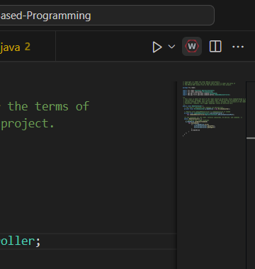
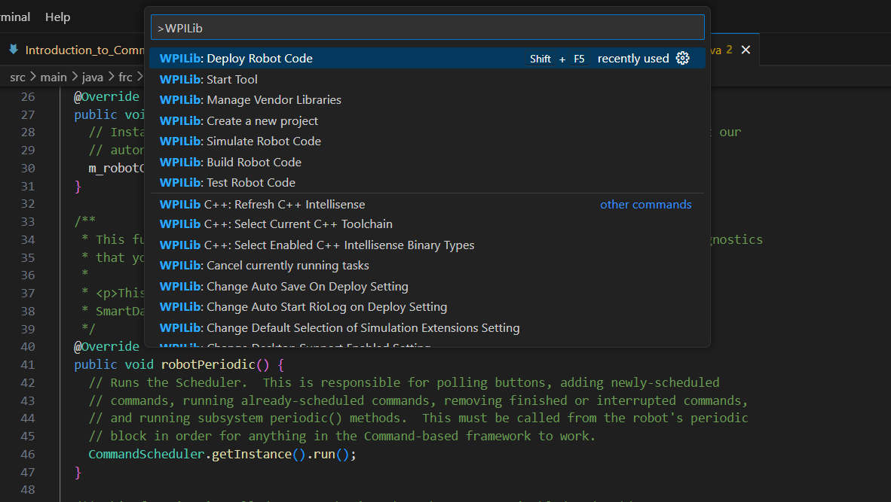
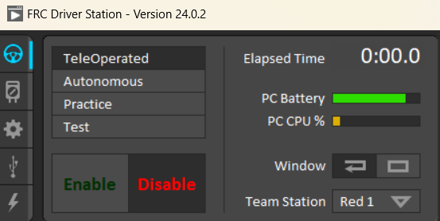

# Introduction to Command Based Programming

>This guide assumes you have set up the FRC development environment and have some previous experience with programming. [Here](https://docs.google.com/document/d/1D_mcwmVLvQwqdbdHkHKadVn-h2wcsIWZaU5CHTG-qwE/edit) is a guide to install the FRC Development Environment, if you do not already have it on your machine. If you have questions or need assistance, feel free to ask David or any of the other returning software team members
## Java
>If you are already familiar with the Java programming language, you can skip this section

In Robotics, we use the Java programming language. Java is an **Object Oriented Language**. This means that everything in Java is an **Object**. **Classes** are essentially "blueprints" for objects. They define how objects behave, and what kinds of information they contain. If we were writing a program to simulate a car, we would start by creating a Car class:
```java
class Car { 

}
```
However, our car has a problem: It can't do anything!
Objects also have **variables**, which hold information about the object, and **methods**, which define the object's behavior. An object's class determines its variables and its methods. Let's add some variables to our car class:
```java
class Car {
    int position = 0;
    int gas = 10;
}
```
>You may be wondering why those variables was preceded by `int`. Java is a **statically-typed** language, meaning that every variable has a type that cannot be changed. When declaring java variables, you **must** include a keyword defining its type. There are eight fundamental data types (referred to as "primitive" in the parlance), only three of which you need to worry about for now:
> - `int`: Integer, stores whole numbers
> - `double`: Double, stores rational numbers in decimal form
> - `boolean`: Boolean, stores true-false values
>
> Another data type which *isn't* primitive but does come up alot is `String`, which represents strings of text (like the one you're reading right now).

Great! Now we have some information about our car. But we still need to make it do stuff. Let's add a method called `drive`, which tells our car to subtract 1 from its gas and add 1 to its position:
```java
class Car {
    int position = 0;
    int gas = 10;
    public void drive() {
        position += 1;
        gas -= 1
    }
}
```

>Methods can take parameters, which are additional data values that are fed as input into the method. The parenthesis in `drive` are there to label its parameters. Because `drive` takes no parameters, its parenthesis are empty, but if we *were* to give `drive` a parameter, it would look something like this:
>```java
>public void drive(int distance) {
>   position += distance;
>   gas -= distance;
>}
>```
>If you want to add multiple parameters, you simply separate them with commas, like this: `someMethod(int parameter, int otherParameter)`. Like variables, parameters need type keywords

> Methods also need keywords which tell Java what kind of data is returned. The `void` keyword tells Java that the `drive()` method does not return anything. The `public` keyword is an **Access modifier**, which tells Java that the `drive()` method can be called outside of the `Car` class.

So now we have a car, we have information about the car, and we have a command that the car can perform! We're done, right? Not so fast. All we have right now is a Car *class*, which is merely a *blueprint* for a Car. To actually create a car, we need to add a special method called a **Constructor**. A class's constructor is a method that creates an object of that class. To make a method into a constructor, we need to give it the same name as its class:
```java
class Car {
    int position = 0;
    int gas = 10;
    public Car() {
        // This particular constructor is empty,
        // but they don't have to be.
        // Often, constructors are used to set the
        // values of an object's variables
    }
    public void drive() {
        position += 1;
        gas -= 1
    }
}
```
>Because constructors *always* return an object of their class, they do not need to have their return type explicitly labeled. In fact, the lack of a return type is one of the ways Java differentiates constructors from normal methods

>The green text is a comment. Comments are ignored by Java, and are exclusively meant to be read by human programmers. You can create a comment by beginning a line with `//`, which will cause Java to ignore the rest of the line.

All this is well and good, but we are missing one final piece: Constructors are *methods*, and methods need to be *called*. However, we cannot call our constructor anywhere *in* our class, since the object that calls our constructor won't exist *until we call the constructor*. Fortunately, Java offers us a solution: the `main()` method. The `main()` method is another special method, which is automatically called by Java when it runs. Let's add a `main()` method to our `Car` class:

```java
class Car {
    int position = 0;
    int gas = 10;
    public Car() {
        // This particular constructor is empty,
        // but they don't have to be.
        // Often, constructors are used to set the
        // values of an object's variables
    }
    public void drive() {
        position += 1;
        gas -= 1;
    }
    public static void main(String[] args){
        Car1 = new Car();
    }
}
```
>the `new` keyword tells Java that the following method call will be a constructor that creates a new object. Whenever you call a constructor, you *must* precede it with `new`

>You may have noticed the `static` keyword on the `main` method. This tells Java that the `main` method belongs to the `Car` *class*, not any particular `Car` object. This means that it can be called *without needing to first create an object*

Almost all classes you write will **not** need a `main` method, as it only ever needs to be called once, as an entry point into the program. After that, you can instantiate objects normally

Here are helpful resources for learning more about Java:

[Codecademy Java Course](https://www.codecademy.com/learn/learn-java)

[MIT Opencourseware Java Introduction](https://ocw.mit.edu/courses/6-092-introduction-to-programming-in-java-january-iap-2010/)

[University of Helsinki Online Java Course](https://java-programming.mooc.fi/)

## Command-Based Programming
For programming our robots, we use a **Command-based** architecture. This means our robot code is divided into three primary components:
- Subsystems, which control the robot's various systems (driving, arms, servos, etc.)
- Commands, which control the subsystems
- The RobotContainer, which instantiates and, well, contains all of the commands and subsystems
### Subsystems 
Today, we will be making a subsystem that will drive Chuck. To begin, go to the src/main/java/frc/robot/subsystems folder, and open "DriveSubsystem.java". You should see something like this:
```java
package frc.robot.subsystems;

import edu.wpi.first.wpilibj2.command.SubsystemBase;
import com.ctre.phoenix.motorcontrol.can.WPI_TalonSRX;

public class DriveSubsystem extends SubsystemBase {
    
    private final WPI_TalonSRX m_leftLeader = new WPI_TalonSRX(7);
    private final WPI_TalonSRX m_leftFollower = new WPI_TalonSRX(2);
    private final WPI_TalonSRX m_rightLeader = new WPI_TalonSRX(5);
    private final WPI_TalonSRX m_rightFollower = new WPI_TalonSRX(3);

    public DriveSubsystem(){
        // Write constructor here

    }
    
    public void drive(double leftSpeed, double rightSpeed){
        // Write drive method here

    }
}
```
Lets break down what each of those things mean:
```java
package frc.robot.subsystems;
```
This part tells Java that this file is part of the 'frc.robot.subsystems' package, and allows us to access our subsystem in other parts of the code.
```java
import edu.wpi.first.wpilibj2.command.SubsystemBase;
import com.ctre.phoenix.motorcontrol.can.WPI_TalonSRX;
```
this part imports the necessary packages for our code. In this case, we are importing the `SubsystemBase` class, which our DriveSubsystem inherits from, and the `WPI_TalonSRX` class, which interfaces with the motors that we're using.
```java
private final WPI_TalonSRX m_leftLeader = new WPI_TalonSRX(7);
private final WPI_TalonSRX m_leftFollower = new WPI_TalonSRX(2);
private final WPI_TalonSRX m_rightLeader = new WPI_TalonSRX(5);
private final WPI_TalonSRX m_rightFollower = new WPI_TalonSRX(3);
```
this part instatiates our motors and points them to the correct motor ports.

Our first task is to build a constructor for the DriveSubsystem class. Because we are building a simple tankdrive, we want all the motors on a given side of the robot to have the same output. While we can manually set the motors to the same output, it would be easier to automate the process. To do this, we will slave the back motors to the front motors, which means that the back motors will automatically copy the output of the front motors:

```java
public driveSubsystem(){
    m_leftFollower.follow(m_leftLeader);
    m_rightFollower.follow(m_rightLeader);
}
```

Now, we only need to worry about the front motors. Because the motors on the robot are facing opposite each other, they will rotate in opposite directions, causing the robot to spin in place. To solve this, we need to reverse one motor's output so that they both rotate in the same direction

```java
public driveSubsystem(){
    m_leftFollower.follow(m_leftLeader);
    m_rightFollower.follow(m_rightLeader);

    m_rightLeader.setInverted(true);
}
```

Next, we need to create the actual `drive` method. Our `drive` method will take two parameters: `leftPower`, and `rightPower`. In our `drive` method, we simply want to set the left motors to `leftPower`, and the right motors to `rightPower`. To set our motors to a power, we simply need to call their `set` method:

```java
public void drive(double leftPower, double rightPower){
    m_leftLeader.set(leftPower);
    m_rightLeader.set(rightPower);
}
```

>Because we slaved our back motors, calling the `set` method on the front motors will automatically also set the back motors to the same power.

Now, we have a functioning drive subsystem! Our code should look something like this:

```java
package frc.robot.subsystems;

import edu.wpi.first.wpilibj2.command.SubsystemBase;
import com.ctre.phoenix.motorcontrol.can.WPI_TalonSRX;

public class DriveSubsystem extends SubsystemBase {
    
    private final WPI_TalonSRX m_leftLeader = new WPI_TalonSRX(7);
    private final WPI_TalonSRX m_leftFollower = new WPI_TalonSRX(2);
    private final WPI_TalonSRX m_rightLeader = new WPI_TalonSRX(5);
    private final WPI_TalonSRX m_rightFollower = new WPI_TalonSRX(3);

    public DriveSubsystem(){
        m_leftFollower.follow(m_leftLeader);
        m_rightFollower.follow(m_rightLeader);

        m_rightLeader.setInverted(true);
    }
    
    public void drive(double leftSpeed, double rightSpeed){
        m_leftLeader.set(leftPower);
        m_rightLeader.set(rightPower);
    }
}
```
### Getting code onto a robot
Now, time to run our code. To do this, we need to first connect to Chuck. To do this, go to your wifi settings, and connect to the **1076_GullLake** network. Once we're connected to Chuck, we need to deploy your code. Press the small 'W' in the top right corner of VSCode to open your command palette.



You should see a drop-down menu. To deploy code, select the **WPILib: Deploy Robot Code** option. This will load our code into the robot. 



Next, we need to enable our code. To do this, open up the **FRC Driverstation** app, and select "Enable". 



>When the orange light on Chuck starts flashing, that means your code is enabled

Congratulations! You have just successfully written and deployed your first robot program! On Wednesday, we will be looking at the RobotContainer